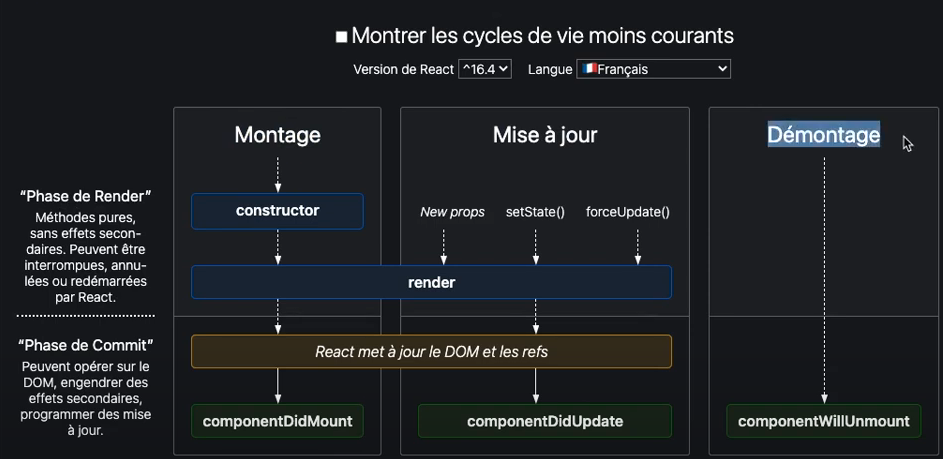

## `fonction closure` ou `closure` (une fonction qui retourne une fonction) => fonction double fléchée


## `currying` (plusieurs fonctions les unes dans les autres, on envoie les arguments à toutes les fonctions en même temps)


## `spread operator`

C'est le fait d'utiliser les {...task} _(déverser un objet)_, on fait, on dit à l'objet de déverser tout ce qu'il a.

Puis dans l'autre fonction, on va récupèrer seulement ce qui nous intéresse.


## LifeCycle Methods
**De base, on n'a pas accés au `document` de `DOM` dans React. C'est pour cela (avoir accés au DOM) qu'on utilise les lifecycle.**

**[Cours de Vincent.](https://drive.google.com/drive/folders/1jsuVVkRNTD7RuFvqwKJasi_StZ2VgBG5)**


On peut les utiliser uniquement dans les `class` component.

Il y a 4 étapes dans ces cycles : 
- Mounting _(naissance)_ : cette méthode est appelée quand l'instance d'un component est créé et inséré dans le DOM

- Updating _(vie)_ : cette méthode est appelée quand un component a été re-`render` suite au changement de props ou de state

- Unmounting _(mort)_ : cette méthode est appelée juste avant qu'un component est été retiré / supprimé du DOM


### `componentDidMount()`
`mounting`
_ps: les chargement de données se font là aussi (fetch())_
À chaque fois qu'un nouveau composant est créé et envoyé dans le dom (après le render), on peut utiliser cette méthode.

Concrétement, c'est dans cette fonction _(qu'on déclare après le constructor)_ qu'on aura accès au DOM et toutes les interactions qu'on voudra faire avec, se passent ici.

```js
componentDidMount() => {
    // ex :
    document.body.addEventListener('click', () => console.log('hello'));
}

```


### `componentDidUpdate()`
`updating`
À chaque fois qu'un composant a une mise à jour (setState(), New Props, forceUpdate()), on peut utiliser cette méthode.

Cette méthode peut avoir plusieurs arguments définis :
 - `prevProps` => les props avant l'update sont égal à ?
 - `prevState` => le state avant l'update est égal à ?


```js
componentDidUpdate(prevProps, prevState) => {
    // cela permet notamment d'optimiser notre code dans le cas
    // où on ne veut exécuter cette méthode QUE s'il y a 
    // un changement dans soit notre state d'un élément
    // ou d'un props
}

```

### `componentWillUnmount()`
`unmounting`
Juste avant qu'on retire un composant du DOM, on peut utiliser cette méthode, et par exemple enlever un listener sur un event.


```js
componentWillUnmount() => {
    // on retire les listeners
    document.body.removeEventListener('click', () => console.log('retiré'));
}

```


## `useRef`


## Immutabilité