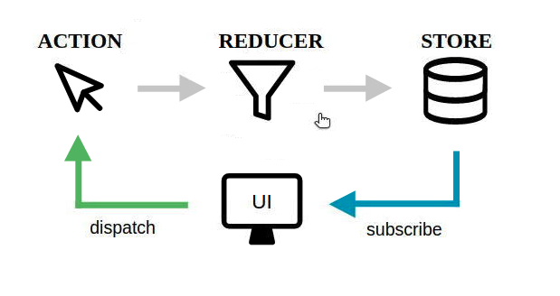

# Redux



1. `yarn add redux`
2. Créer un dossier `store` dans `src`
3. Dedans, créer `index.js`

```js
// fonction qui permet de créer un store
import { createStore } from 'redux';

const store = createStore();

export default store;
```

**Le store est un objet qui a 3 méthodes principales :**
- `getState()` : méthode qui permet de récupérer le state courant
- `dispatch()` : méthode qui permet de changer les valeurs du state en donnant une action à faire
- `subscribe()` : méthode qui permet de nous abonner au changement du state


4. Importer ce `store` dans le main

5. Créer un dossier `reducers`
Nous y stockerons nos reducers

6. Créer un fichier `reducer.js`

_Dans le reducer, on doit avoir TOUS NOS STATES. Le role du reducer est de **TOUJOURS** return le state courant._

```js
const INITIAL_STATE = {
    // ici on met tous nos states de base
    // ex : 
    firstColor: '#e367a4',
    direction: ''
}

fonction reducer(state = INITIAL_STATE) {
    console.log("Dans le reducer");

    return state;
}

export default reducer;
```

7. Aller dans le `store` : **importer** ET le **passer** la fonction `reducer` dans le `createStore(reducer)` :

```js
import { createStore } from 'redux';
// IMPORTER REDUCER
import reducer from 'src/reducers';

// c'est ici qu'on doit mettre le reducer (qui contient le state)
const store = createStore(reducer);

export default store;
```

8. Dans le fichier `index.js` général `/src`

- on importe le `store`
- pour voir nos states, on utilise la fonction décrite au dessus : `getState()` 
  - voici à quoi cela ressemble : 
    ```js
    // permet de retourner / voir tous nos states déclarés
    console.log(store.getState());
    ```

9. Changer la valeur d'UNE propriété : `dispatch()`

Dans le `src/index.js` (là où on a notre code), on va dans la fonction dans laquelle on veut qu'une donnée soit changée, et on déclare un `store.dispatch({})` avec **OBLIGATOIREMENT** une clé `type: '',`

Supposons qu'on veut changer la 'direction' : 

```js
// ici on veut changer la valeur de la propriété "direction" du state
// le state est désormais dans le store. Il va donc falloir discuter avec le store. Pour faire cela, on va passer par dispatch()
// store.dispatch('CHANGE_LA_DIRECTION');
// l'action qu'on va donner au store va être un objet
// une action a toujours une propriété "type"

// par convention le type d'action est écrit en UPPERCASE_SNAKE_CASE
store.dispatch({
    type: 'CHANGE_DIRECTION_TO_LEFT',
});
```

10. Créer un dossier `src/actions`, dedans : `index.js`

Dedans, on va déclarer des fonctions qui portent **LE_MEME_NOM** que les `type: 'CE_NOM'`, et les `export` une par une afin de pouvoir les UTILISER dans le `reducer`

```js
export const CHANGE_DIRECTION_TO_LEFT = 'CHANGE_DIRECTION_TO_LEFT'
export const CHANGE_DIRECTION_TO_RIGHT = 'CHANGE_DIRECTION_TO_RIGHT'
// ... etc, de cette manière, on pourra juste utiliser ces NOMS de fonctions SANS AVOIR A METTRE de guillemets autour des CASE (cf : en dessous, condition switch)
```

11. On va dans le `reducer` car c'est lui qui fait changer le state

_PS: ne pas oublier d'importer les fonctions / variables de l'étape 10_

On y rajoute un deuxième paramètre `action = {}` :

```js
// DU COUP, on importe les variables / fonctions qu'on vient de créer étape 10 :
import { CHANGE_DIRECTION_TO_LEFT, /* et les autres */ } from '../actions';

const INITIAL_STATE = {
    // ici on met tous nos states de base
    // ex : 
    firstColor: '#e367a4',
    direction: ''
}

// c'est ici qu'on déclare en paramètre numéro 2 : action = {}
fonction reducer(state = INITIAL_STATE, action = {}) {
    console.log("Execution du reducer", action);

  // Suivant l'action on va pas faire la mÊme chose
  // Du coups autant tester l'action
    switch (action.type) {
        // On ne met pas de guillemets autour de CHANGE_DIRECTION.... car on a créé une fonction dans src/actions/index.js qui a ce nom et qui return le même nom
        case CHANGE_DIRECTION_TO_LEFT:
        return {
            // on DEVERSE d'abord le state car si on déclare directement 'direction', ça va changer TOUT l'objet du state en juste 'direction: '
            ...state,
            // on précise ce qui doit se passer dans CE CASE
            direction: '270deg',
        };

        case CHANGE_DIRECTION_TO_RIGHT:
        return {
            ...state,
            direction: '90deg',
        };
        case SET_LAST_COLOR:
        return {
            ...state,
            lastColor: action.color,
            nbColors: state.nbColors + 1,
        };
        case SET_FIRST_COLOR:
        return {
            ...state,
            firstColor: action.color,
            nbColors: state.nbColors + 1,
        };
        default:
        // Attention un réduceur DOIT TOUJOURS renvoyer un state
        // Si il n'y a pas eu de changement, autant renvoye l'ancien state
        // C'est à dire celui qu'on recoi en paramètre ( envoyé depuis le store)
        // Si on renvoie autre chose, le state deviendra cette autre chose
        // Du coups si ici on renvoie rien ou undefined
        // notre state de l'app deviendra undefined

        // en DEFAULT, donc sans changements, il doit juste renvoyer le STATE normal de base
        return state;
    }
}

export default reducer;
```