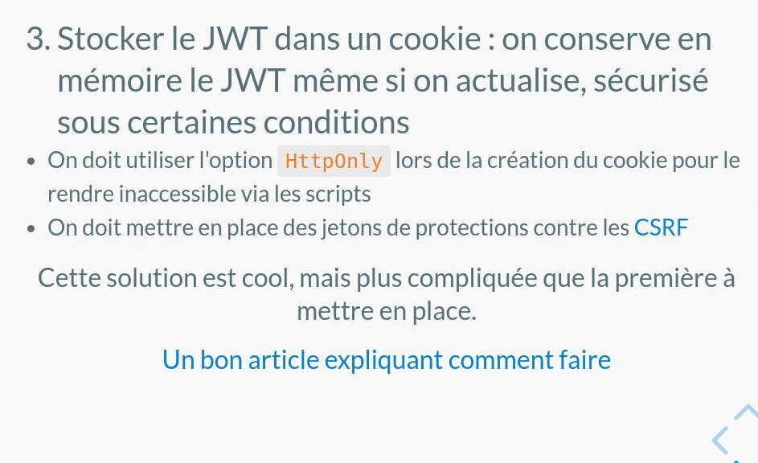
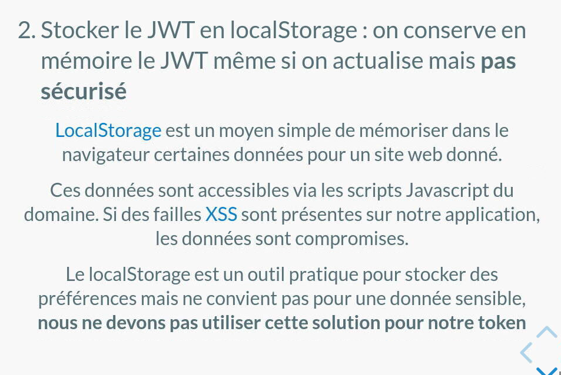

# oRecipe - Connexion / Login

## JWT

**JSON Web Token**

Cette méthode est LA PLUS SÛRE ET SÉCURISÉE mais on ne va pas l'apprendre lors de notre cours.
[Lire cet article pour découvrir](https://medium.com/@ryanchenkie_40935/react-authentication-how-to-store-jwt-in-a-cookie-346519310e81)

Voilà ce qu'on apprend :

Les tokens.

## Les étapes pour relier les JWT et faire la connexion / login

